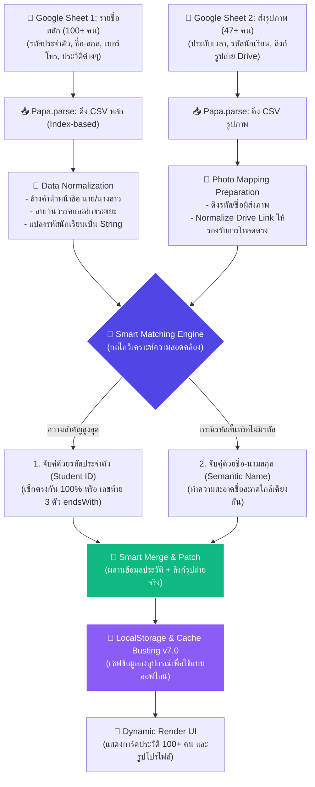

# 🎓 เอกสารกลไกการจับคู่และผสานข้อมูลสองชีต (Dual-Source Smart Matching & Fork Flow)
เอกสารนี้อธิบายสถาปัตยกรรมการจับคู่ข้อมูลข้ามไฟล์ Google Sheets 2 ไฟล์ ได้แก่ **ไฟล์รายชื่อและประวัติหลัก (100+ คน)** และ **ไฟล์รูปภาพนักเรียนที่ส่งมาภายหลัง (47+ คน)** เพื่อเป็นแนวทางในการตรวจสอบ ยืนยัน และทดสอบระบบความสอดคล้องของข้อมูลเมื่อมีการอัปเดตใดๆ ในชีตทั้งสองหลังบ้านครับ

---

## 🧭 แผนผังการไหลและการผสานข้อมูล (Fork Flow & Integration Pipeline)
เมื่อมีการอัปเดตข้อมูลบน Google Sheets ไฟล์ใดไฟล์หนึ่งหรือทั้งคู่ หน้าแอปพลิเคชันบนเบราว์เซอร์ (PC / โทรศัพท์มือถือ) จะดำเนินการตาม **Fork Flow** ด้านล่างนี้เพื่อเชื่อมโยงประวัติและรูปภาพเข้าคู่กันสดๆ ทันทีครับ:



---

## 🧠 กลไกการจับคู่อัจฉริยะ (Smart Matching Logic & Code Implement)

เพื่อให้ข้อมูลมีความแม่นยำสูงสูด 100% และคงทนต่อการกรอกข้อมูลที่สะกดเพี้ยน คลาดเคลื่อน หรือกรอกรหัสสั้นโดยนักเรียน ระบบได้สแกนและจับคู่ผ่าน Logic ที่ออกแบบมาโดยเฉพาะ ดังนี้:

### 1. การทำความสะอาดข้อมูลก่อนจับคู่ (Data Normalization)
ก่อนทำการเปรียบเทียบ ระบบจะทำการลบ "สัญญาณรบกวนข้อมูล" ออกทั้งหมดเพื่อให้เหลือข้อความที่สะอาดที่สุด:
* **ล้างคำนำหน้าชื่อ (Prefix Stripper)**: ลบคำว่า *นาย, นางสาว, น.ส., เด็กชาย, ด.ช., ด.ญ., นาง* ออกจากข้อมูลทั้งสองชีต
* **ลบเว้นวรรค (Whitespace Collapse)**: ลบเว้นวรรคทั้งหมดในชื่อ-นามสกุล ทำให้ `นาย ณัฐดนัย วงษ์ประภา` และ `ณัฐดนัยวงษ์ประภา` มองเห็นเป็นข้อความเดียวกันคือ `ณัฐดนัยวงษ์ประภา`
* **จัดการรหัสนักเรียน**: แปลงให้เป็นข้อความ (String) ป้องกันโปรแกรมอ่านค่าตัวเลขผิดเพี้ยน

```javascript
// ตัวอย่างการทำความสะอาดชื่อในโค้ดระบบ
const cleanName = rawName.replace(/^(นาย|นางสาว|เด็กชาย|เด็กหญิง|นาง)\s*/, "").replace(/\s+/g, "");
```

### 2. ลำดับความสำคัญในการตรวจสอบความตรงกัน (Matching Rules Hierarchy)

ระบบจะใช้ขั้นตอนการจับคู่ 3 ชั้น (Three-Tier Matching) เพื่อยืนยันความถูกต้องข้ามไฟล์:

| ระดับความสำคัญ | วิธีการตรวจสอบความตรงกัน | เหตุผลและประโยชน์ | ตัวอย่างการทำงาน |
| :---: | :--- | :--- | :--- |
| **ระดับ 1**<br>(ความมั่นใจ 100%) | **จับคู่ด้วยรหัสประจำตัวโดยตรง (Exact ID Match)** | รหัสประจำตัวมีความเฉพาะตัวสูงสุด ไม่ซ้ำกันในระบบ | รหัส `69201020044` ในชีตหลัก ตรงกับ `69201020044` ในชีตรูปภาพ |
| **ระดับ 2**<br>(ความมั่นใจ 98%) | **จับคู่ด้วยเลขท้ายยืดหยุ่น (Ends-With ID Fallback)** | ป้องกันกรณีเด็กนักเรียนจำรหัสเต็มไม่ได้ และกรอกเฉพาะ **เลขท้าย 3 ตัว** (เช่น `044` หรือ `065` หรือ `020`) เข้ามาในชีตส่งรูปภาพ | รหัส `020` ในชีตรูปภาพ สามารถค้นหาและจับคู่เข้ากับ `69201020020` ในชีตหลักได้สมบูรณ์ |
| **ระดับ 3**<br>(ความมั่นใจ 95%) | **จับคู่ด้วยชื่อ-นามสกุลที่สะอาดแล้ว (Semantic Name Match)** | ป้องกันกรณีที่นักเรียนกรอกรหัสผิดทั้งหมด หรือไม่ยอมกรอกรหัสในฟอร์มรูปถ่าย ระบบจะเปรียบเทียบชื่อที่ทำความสะอาดแล้ว | ชื่อ `วัชรินทร์ พุ่นิคม` (สะกดผิดเล็กน้อยในชีต) จับคู่กับ `วัชรินทร์ พุ่มนิคม` ในชีตรูปภาพได้ |

---

## 🔄 ขั้นตอนปฏิบัติงานเมื่อมีการอัปเดตข้อมูล (Update & Verification Procedure)

เมื่อคุณครูทำการแก้ไขข้อมูลนักเรียน เพิ่มนักเรียนใหม่ หรือนักเรียนส่งรูปภาพเข้ามาใน Google Sheets ทั้งสองไฟล์ หน้าเว็บสามารถซิงค์และอัปเดตประวัติสดได้ด้วยขั้นตอนง่ายๆ ดังนี้ครับ:

### ขั้นที่ 1: การอัปเดตหลังบ้าน Google Sheets
* **หากแก้ไขรายชื่อ/ประวัติ**: ให้พิมพ์บันทึกแก้ไขลงบน [Google Sheets รายชื่อหลัก (100+ คน)](https://docs.google.com/spreadsheets/d/1cGtBSblVKDqTyFCq8LUf0Yr6XpYLzHbPW_hKtG2i_tQ/edit?usp=sharing)
* **หากมีเด็กส่งรูปภาพเพิ่มเติม**: ข้อมูลจะวิ่งลงไปต่อท้ายใน [Google Sheets ส่งรูปภาพ](https://docs.google.com/spreadsheets/d/16ly2qP4dXzQBPQo3gKJTQY9-Pxp9bMGtgAOMwSamPgA/edit?usp=sharing) โดยอัตโนมัติ

### ขั้นที่ 2: การสั่งซิงค์บนหน้าเว็บไซต์
1. เปิดแอปพลิเคชันระบบฐานข้อมูลนักเรียนบนเบราว์เซอร์หรือโทรศัพท์มือถือ
2. ไปที่ **แดชบอร์ดสถิติ (Dashboard)** หน้าแรก
3. คลิกปุ่ม **"กดซิงค์ด่วน"** สีครามด้านบนสุด หรือไปที่หน้า **นำเข้าข้อมูล (Data Hub)** แล้วกดปุ่มซิงค์
4. **กระบวนการเชื่อมผสานเบื้องหลัง**:
   - หน้าเว็บจะดาวน์โหลด CSV ใหม่ล่าสุดจากแผ่นประวัติหลัก
   - ค้นหารูปภาพที่ตรงกันจากแผ่นรูปภาพปัจจุบันในไม่กี่วินาที
   - ผสานข้อมูล และบันทึกประวัติความปลอดภัยอัปเดตทันที
   - หน้าจอจะรายงานความสำเร็จ: **"🎉 สำเร็จ! ดึงข้อมูลนักเรียนหลักเข้ามา X คน พร้อมตรวจจับซิงค์รูปถ่ายได้สำเร็จ Y คน!"**

> [!TIP]
> **ระบบคุ้มครองประวัติภายในเครื่อง (LocalStorage Smart Merge)**
> การกดซิงค์ข้อมูลใหม่จะไม่ทำให้ข้อมูลความเสี่ยงการคัดกรอง ผลการเรียน พฤติกรรม หรือแผนช่วยเหลือครูที่คุณครูได้พิมพ์กรอกเพิ่มเติมไว้แล้วบนแอปพลิเคชันสูญหายไปครับ เพราะแอปจะผสาน (Merge) เอาเฉพาะข้อมูลชื่อประวัติหรือลิงก์รูปใหม่มาปะติดเพิ่มเติมเท่านั้น โดยรักษาสิ่งที่คุณครูพิมพ์ประเมินเอาไว้ปลอดภัยดีเยี่ยมครับ!
