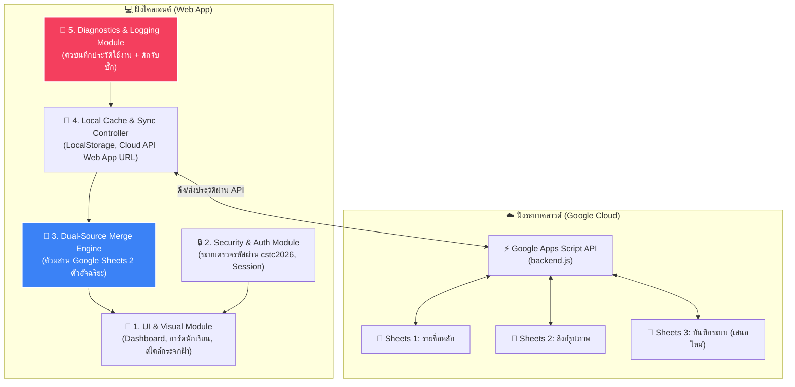

# 📋 แผนการจัดการระบบคลังบันทึกการใช้งาน ตัวจัดเก็บข้อผิดพลาด และการแบ่งหมวดหมู่ระบบ (System Logging, Diagnostics & Modularization Plan)

เพื่อเพิ่มความมั่นคงและง่ายต่อการบำรุงรักษาระบบฐานข้อมูลนักเรียนและการประเมินความเสี่ยงที่คุณครูใช้งานบนโน้ตบุ๊กทั้ง 2 เครื่อง เอกสารฉบับนี้คือ **"แผนโครงสร้างการแยกหมวดหมู่ระบบ"** พร้อม **"แนวทางการจัดเก็บประวัติการใช้งานและดักจับข้อผิดพลาด (Bugs)"** ซึ่งจะช่วยให้คุณครูและผมสามารถวิเคราะห์หาสาเหตุและแก้ไขปัญหาที่เกิดขึ้นได้ทันทีครับ

---

## 🧩 1. การแบ่งหมวดหมู่การทำงานของระบบ (System Modularization)

ปัจจุบันโค้ดของระบบฐานข้อมูลมีการเติบโตและมีความซับซ้อนเพิ่มขึ้น เพื่อให้การแก้ไขระบบในอนาคตไม่ส่งผลกระทบซึ่งกันและกัน เราจะแบ่งหมวดหมู่ของโค้ดและการทำงานออกเป็น **5 หมวดหมู่หลัก (Modules)** ดังนี้ครับ:



### รายละเอียดหน้าที่ของแต่ละหมวดหมู่:
1. **หมวดการแสดงผลและดีไซน์ (UI & Visual Module)**: ควบคุมการแสดงผลการ์ดรายบุคคล, ค่าสถิติ SDQ บนแดชบอร์ด, ปุ่มนำทาง และการตอบสนองต่อหน้าจอมือถือ
2. **หมวดความปลอดภัยและการเข้าถึง (Security & Auth Module)**: ดำเนินการรักษาความปลอดภัย ตรวจสอบการป้อนรหัสล็อกอิน และคงสถานะการล็อกอินไว้ชั่วคราวเพื่อป้องกันการแอบดูข้อมูลประวัตินักเรียน
3. **หมวดผสานข้อมูลคู่ขนาน (Dual-Source Merge Engine)**: รับ CSV 2 ชุด นำมาล้างค่า ทำ Normalize คำนำหน้า และจับคู่เชื่อมรูปภาพเข้ากับรายชื่อประวัติ
4. **หมวดหน่วยความจำและการส่งข้อมูล (Local Cache & Sync Controller)**: บริหารจัดการเนื้อหาใน `localStorage` และรับหน้าที่ส่งสัญญาณ HTTP Fetch ไปยังคลาวด์ Google Sheets หลังบ้าน
5. **หมวดวิเคราะห์ประวัติและบันทึกบั๊ก (Diagnostics & Logging Module - เสนอใหม่)**: ทำหน้าที่เก็บประวัติการคลิกใช้งานในแอป และเฝ้าระวังดักจับข้อผิดพลาดของสคริปต์ (Errors) ทั้งหมด

---

## 📝 2. แผนการจัดเก็บข้อมูลการใช้งาน (Usage & Activity Logging)

เนื่องจากคุณครูมีโน้ตบุ๊ก 2 เครื่อง การจัดเก็บล็อกจะแบ่งออกเป็น 2 ระดับเพื่อให้คุณครูสามารถตรวจสอบย้อนหลังได้ว่าเครื่องไหนทำอะไรไป:

### 2.1 บันทึกกิจกรรมภายในเครื่อง (Local Application Logs)
* **สิ่งที่จะเก็บ**: 
  * วัน-เวลาที่กดเข้าสู่ระบบ
  * อุปกรณ์/บราวเซอร์ที่เข้าใช้งาน
  * วัน-เวลาที่กดสั่ง "ซิงค์ข้อมูลด่วน" และจำนวนรายชื่อนักเรียนที่ซิงค์สำเร็จ
  * รายชื่อหรือจำนวนนักเรียนที่มีการกดบันทึกแก้ไขข้อมูลล่าสุดบนเครื่องนั้น ๆ
* **วิธีจัดเก็บ**: จัดเก็บในตัวแปร `app_system_logs` ใน LocalStorage (จำกัดประวัติย้อนหลังไว้สูงสุด 100 รายการเพื่อไม่ให้เครื่องอืด)

### 2.2 บันทึกกิจกรรมขึ้นสู่คลาวด์ (Cloud Shared Logs - เสนอให้เพิ่มในแท็บชีต)
* **สิ่งที่จะเก็บ**: การบันทึกแก้ไขที่สำคัญ เช่น การแก้เกรดประเมิน หรือข้อมูลสำคัญที่จะต้องขึ้นไปแจ้งเตือนบนคลาวด์
* **รูปแบบข้อมูล**:
  ```json
  {
    "timestamp": "2026-05-26 13:10:00",
    "device": "Notebook-1 (Chrome/Windows)",
    "action": "แก้ไขข้อมูลประเมินความเสี่ยง SDQ",
    "target_student": "69201020020 - ณัฐดนัย"
  }
  ```

---

## 🐛 3. แผนการดักจับและจัดเก็บบั๊ก (Bug & Error Tracking)

ปัญหาคลาสสิกของแอปพลิเคชันที่ต่อคลาวด์คือ "เมื่อเน็ตหลุด" หรือ "โครงสร้าง Google Sheets ของคุณครูเปลี่ยนไป" แล้วแอปจะค้างและไม่แจ้งเตือน เราจะติดตั้งระบบดักจับบั๊กเชิงรุก ดังนี้ครับ:

### 3.1 รูปแบบการจัดหมวดหมู่บั๊ก (Bug Categorization Table)

| หมวดหมู่บั๊ก | สาเหตุที่อาจเกิดขึ้น | วิธีดักจับ (Catch Logic) | การแจ้งเตือนและการเยียวยา (Mitigation) |
| :--- | :--- | :--- | :--- |
| **🔌 Network Error**<br>(เชื่อมต่อชีตไม่ได้) | - อินเทอร์เน็ตขาดหาย<br>- บริการ Google API ขัดข้อง<br>- ลิงก์ Web App API พิมพ์ผิด | ใช้ `try {} catch (err)` ในคำสั่ง `fetch()` ตรวจหา HTTP status | - ขึ้นแบนเนอร์สีส้มแจ้งเตือนบนหน้าจอ: *"การซิงค์ออนไลน์ขัดข้อง ระบบจะปรับไปใช้งานข้อมูลล่าสุดในเครื่องอัตโนมัติ"*<br>- บันทึกลงไดอะรีประวัติปัญหา |
| **📊 Structure Mismatch**<br>(โครงสร้างตารางเปลี่ยน) | - คุณครูพิมพ์เปลี่ยนชื่อหัวคอลัมน์ในชีต<br>- คอลัมน์ที่จำเป็นถูกย้ายหรือลบออก | ตรวจสอบดัชนีคอลัมน์ (Index Verification) ในขั้นตอนประมวลผล CSV | - หากหาคอลัมน์สำคัญ (รหัสนักเรียน/ชื่อ) ไม่พบ ให้แจ้งเตือนคุณครูเป็นป็อปอัปสีแดง<br>- แนะนำให้ตรวจชื่อหัวตารางในกูเกิลชีต |
| **🔑 Auth Timeout**<br>(รหัสผ่านหลุด) | - ความจำแคชถูกลบโดยตัวบราวเซอร์<br>- ล็อกอินค้างไว้ข้ามวัน | ตรวจสอบ Session state ทุกครั้งที่เปลี่ยนหน้าเมนู | - บังคับเด้งกลับหน้าล็อกอินอย่างปลอดภัย<br>- แจ้งเตือน: *"หมดระยะเวลาเซสชัน กรุณากรอกรหัสผ่านอีกครั้ง"* |
| **📸 Photo Missing**<br>(รูปภาพไม่ขึ้น) | - เด็กพิมพ์รหัสผิดและชื่อสะกดเพี้ยนพร้อมกัน<br>- ลิงก์ Drive ถูกตั้งค่าเป็นส่วนตัว | ตรวจจับการจับคู่ที่ไม่พบผลลัพธ์ หรือ URL โหลดไม่สำเร็จ (`onerror` ของรูปภาพ) | - แสดงรูปภาพจำลองพรีเมียม (Avatar Placeholder) เรืองแสงแทนเพื่อความสวยงาม<br>- ล็อกแจ้งรหัสนักเรียนที่ไม่มีรูปในหน้าจอวิเคราะห์ระบบ |

### 3.2 ปุ่มตรวจสอบระบบสำหรับคุณครู (System Diagnostic Dashboard Button)
เราจะเพิ่ม **"หน้าต่างวิเคราะห์และบันทึกประวัติระบบ (Diagnostics Panel)"** ไว้ในส่วนตั้งค่าบนหน้าเว็บ:
* คุณครูสามารถเข้าไปตรวจสอบ **"ประวัติกิจกรรมล่าสุด"** และ **"ประวัติบั๊ก/ข้อผิดพลาด"** บนเครื่องของโน้ตบุ๊กแต่ละเครื่องได้ทันที
* จะมีปุ่ม **"คัดลอกรายงานบั๊กสำหรับส่งให้นักพัฒนา (Copy Debug Report)"** ซึ่งจะช่วยรวบรวมข้อมูล Error, สเปกเครื่องบราวเซอร์ และสถานะฐานข้อมูลล่าสุดทั้งหมดเป็นข้อความปุ่มเดียว เพื่อให้คุณครูก๊อปปี้ส่งต่อมาให้ผมทำการวิเคราะห์บั๊กได้อย่างแม่นยำและรวดเร็วสูงสุดครับ!

---

## 🗺️ 4. แผนปฏิบัติการการปรับปรุงระบบ (Roadmap & Execution Plan)

หากคุณครูเห็นชอบกับแผนบริหารจัดการฉบับนี้ เราจะเริ่มดำเนินการแบ่งสัดส่วนโค้ดใน `app.js` และสร้างฟังก์ชันเหล่านี้ทีละส่วนตามขั้นตอนด้านล่างนี้ครับ:

* [ ] **ขั้นตอนที่ 1**: แบ่งสัดส่วนโค้ดในไฟล์ `app.js` ออกเป็นหมวดหมู่อย่างเป็นระบบโดยใช้คอมเมนต์จำแนกส่วน (Module Segmentation)
* [ ] **ขั้นตอนที่ 2**: เขียนสร้างฟังก์ชันตรวจจับข้อผิดพลาดแบบครอบจักรวาล (Global Error Listener) และระบบสร้างรายงานดีบัก (`debugReportGenerator`)
* [ ] **ขั้นตอนที่ 3**: ออกแบบและเพิ่มส่วนปุ่มรายงานบั๊กและแสดงประวัติการซิงค์กิจกรรมล่าสุดบนหน้า Settings เพื่อให้คุณครูเปิดเช็กข้อมูลการใช้งานข้ามอุปกรณ์ได้ทันที
* [ ] **ขั้นตอนที่ 4**: ทำการทดสอบจำลองบั๊กเน็ตหลุด หรือบั๊กคอลัมน์ผิดพลาด เพื่อตรวจทานว่าระบบแจ้งเตือนข้อความเตือนภัยสีส้มและบันทึกประวัติการใช้งานได้สมบูรณ์

> [!NOTE]
> แผนงานการจัดเก็บข้อมูลการใช้งานและวิเคราะห์บั๊กนี้จะทำงานอยู่บนหน่วยความจำของบราวเซอร์และโฟลเดอร์ Google Drive ของคุณครูโดยตรง ข้อมูลความปลอดภัยของเด็กนักเรียนจะได้รับการรักษาอย่างปลอดภัย 100% และไม่มีการแชร์รั่วไหลออกสู่อินเทอร์เน็ตสาธารณะภายนอกครับ

คุณครูมีความคิดเห็นอย่างไรกับแผนการจัดการระบบและการคัดแยกหมวดงานฉบับนี้บ้างครับ? สามารถเสนอแนะการปรับปรุงเพื่อพัฒนาต่อยอดระบบให้มีคุณภาพยิ่งขึ้นได้ทันทีเลยครับผม! 😊
